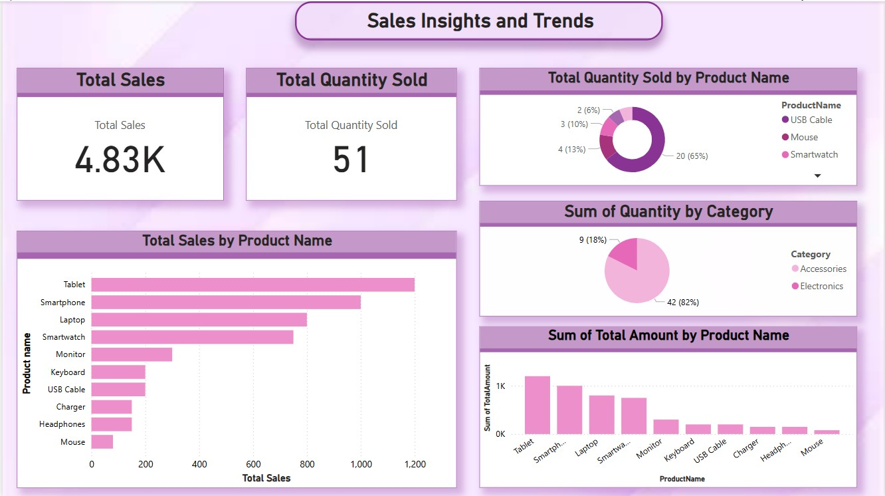

Sales Data ETL Pipeline & Power BI Dashboard

Project Overview

This project demonstrates an end-to-end ETL pipeline for sales data using SQL Server and Power BI. The goal is to extract, transform, and load (ETL) sales data into a structured format, enabling insightful data visualization through a Power BI dashboard.

Features

✔️ Extract sales data from a CSV file
✔️ Transform and clean data using SQL
✔️ Load data into a SQL Server database
✔️ Create a Power BI Dashboard for insights

Tech Stack

Database: Microsoft SQL Server

ETL Processing: SQL Queries

Visualization: Power BI

 Project Structure

 --ETL-PowerBI-Sales-Dashboard
 
 |create_database.sql **SQL script to create the database & tables**
 |load_data.sql **SQL script to load data from CSV**
 |data_transformation.sql **SQL script for data cleaning & transformation**
 |queries_for_visualization.sql  **SQL queries for Power BI visuals**
 |README.md  **Project documentation**
 |Sales_Insights.pbix  **Power BI Dashboard file**

 
Installation & Setup

Setup SQL Server

1.Download & Install SQL Server (Developer Edition)

2.Install SQL Server Management Studio (SSMS)

3.Run create_database.sql to create the SalesDB database

Load Data into SQL Server

1.Use load_data.sql to insert sales data into the Sales table

Transform Data

1.Run data_transformation.sql to clean and prepare the data

Connect SQL Server to Power BI

1.Open Power BI Desktop

2.Click Home > Get Data > SQL Server

3.Enter Server Name and connect to SalesDB

4.Load the Sales table

Visualize Data in Power BI

1.Import queries_for_visualization.sql for KPIs & trends

2.Open Sales_Insights.pbix to view the dashboard

Power BI Dashboard Features

🔹 KPI Cards: Total Sales & Total Quantity Sold
🔹 Bar Chart: Sales by Product
🔹 Line Chart: Sales Trend Over Time
🔹 Filters & Slicers: For dynamic data exploration

Key Learnings

✅ How to design an ETL pipeline
✅ Writing SQL queries for data transformation
✅ Building interactive dashboards in Power BI

Future Enhancements

1.Integrate real-time data sources

2.Implement advanced DAX calculations

3.Add predictive analytics using Python/R

Dashboard Preview

Connect With Me

For any queries or feedback, feel free to reach out!
